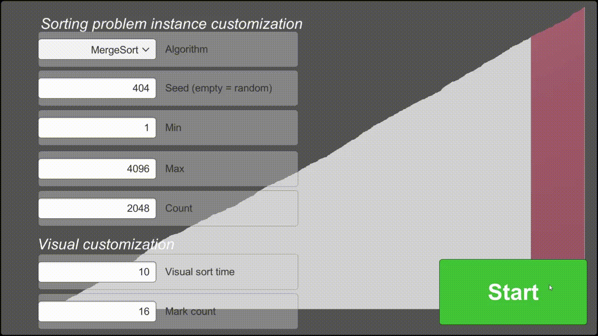

# Overview

Talgdat is a Unity project that visualizes algorithms.
The project uses an iterative model in order to gradually increase functionality.
Current iteration: iteration 2

# Functionality of iteration 2
The user may currently configure integer-sorting problem instances,
along with choosing a sorting algortihm for solving that instance.
There are five sorting algortihms to choose from:
- Mergesort
- Heapsort
- Quicksort
- Bogosort
- Optimized Bogosort (yes, really)

# How to download and run
1. Download the .zip file called "TalgdatProgram.zip"
2. Extract all files
3. Run "Talgdat.exe"
While running the program, click "H" to show/hide problem instance config.

# Known Issues
- No input validation
The program supposes that the user inputs valid parameters.
If the configuration is *invalid*, nothing happens.
If the configuration is *too difficult*, e.g. bogosorting 1000 integers, the program may crash.
